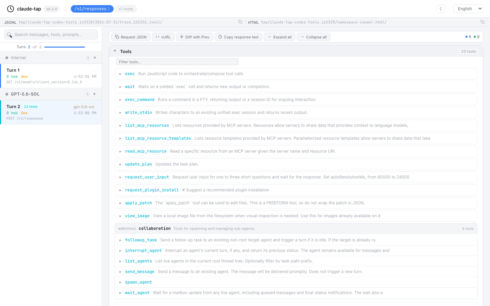

# OpenAI namespace tools hidden in the viewer

## Symptom

OpenAI Responses requests can define a namespace such as `web` with callable
children such as `run`. The viewer showed only the namespace name and omitted
the child description and parameter schema. Tool search, filtering, diffs, and
prompt exports also treated the namespace as a single callable tool.

## Cause

The request parser correctly found `input[].additional_tools`, but every
consumer assumed that each item was a leaf tool. Namespace children live in a
nested `tools[]` array and need recursive normalization.

## Resolution

Normalize namespace children into qualified callable names such as `web.run`.
The viewer preserves the hierarchy with a compact namespace group, shows leaf
functions inside it, and expands each function independently. Filtering matches
the qualified name, description, and rendered parameter schema.

The screenshot below uses a real Codex CLI trace captured on 2026-07-31. It
shows the `collaboration` namespace and its six callable child tools.

